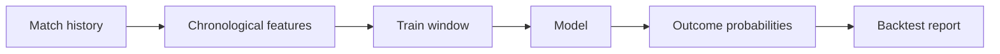

# Total Football Forecast - Public Portfolio Edition

A reproducible soccer forecasting pipeline for turning historical match results into calibrated home/draw/away probabilities.

This repository is a public reconstruction of the core modelling workflow behind **Total Football Forecast**, a soccer analytics product originally developed from 2023 to 2025. Production data, customer information, commercial logic, and private infrastructure are intentionally excluded. The included demo uses generated fixtures so the full pipeline can be run safely from end to end.

## What it demonstrates

- Leakage-aware, chronological feature engineering with recent form and opponent strength
- Multiclass logistic regression and gradient-boosted tree models
- Walk-forward backtesting with accuracy, multiclass log loss, and Brier score
- A deterministic synthetic-data generator for a one-command demo
- Clean Python packaging, type hints, unit tests, and GitHub Actions CI



## Quick start

```bash
python -m venv .venv
source .venv/bin/activate
pip install -e .
tff-demo --matches 600 --seed 42
```

Example output:

```text
model                     accuracy    log_loss     brier
logistic_regression          0.647       0.816     0.468
gradient_boosting            0.627       1.049     0.560
```

Metrics vary slightly with the generated season. The goal is to make the evaluation process transparent rather than claim production performance from synthetic data.

## Repository layout

```text
src/tff/
  data.py       deterministic synthetic match generator
  features.py   pre-match rolling features
  model.py      training, probabilities, and evaluation
  cli.py        one-command demonstration
tests/          regression and leakage checks
```

## Modelling notes

Every feature for match `t` is computed only from matches before `t`. Team ratings are updated after the row is created, preventing the target from leaking into the predictors. The test split is the newest 25% of matches instead of a random sample, which better resembles forecasting upcoming fixtures.

## Responsible use

This project is an educational analytics demonstration, not betting advice. Generated match data should never be interpreted as real-world predictions.

## Original project context

The original product combined historical match ingestion, Pandas feature pipelines, logistic regression and gradient-boosted models, scheduled forecasts, and a customer-facing delivery workflow. This portfolio edition focuses on the modelling components that can be shared publicly.

## License

MIT
